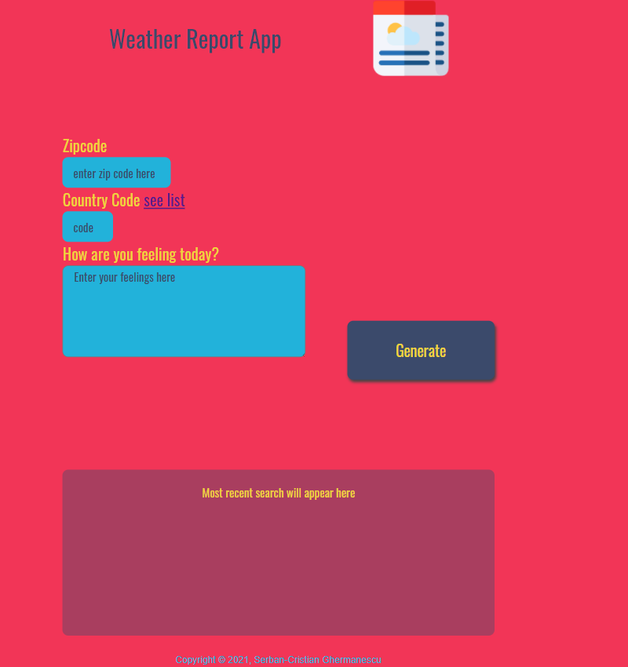
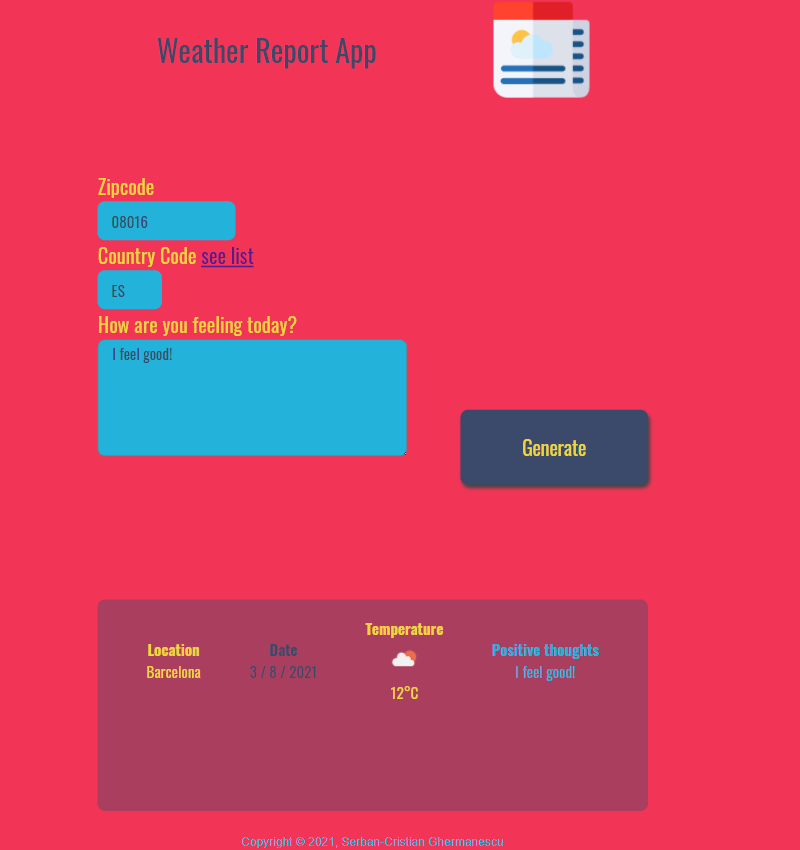

# weatheReport
**Asynchronous** web app that uses **Web API** and user data to dynamically update the UI in a Weather Journal Application. 

It makes use of a **Node & Express Environment** to capture data, fetched from the [OpenWeatherMap API] (https://openweathermap.org/api), on the server's endpoint and then posts it on the client side via express route.

